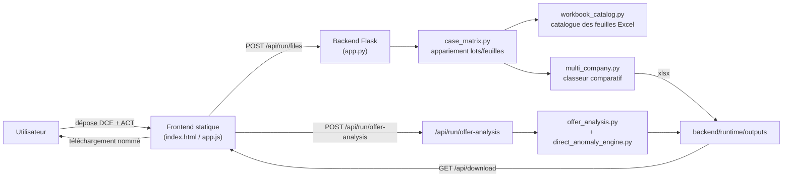
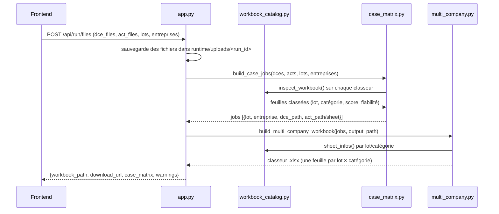
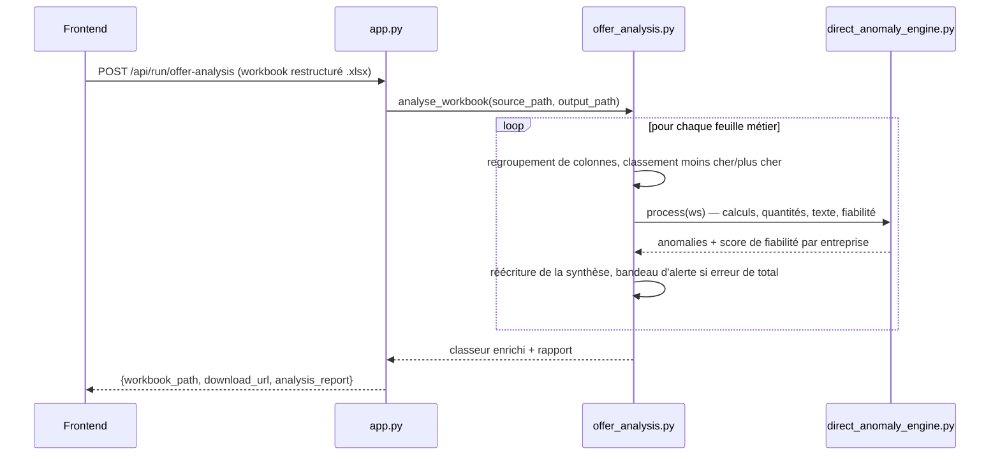

# AnalyseAO

Outil local (Flask + JavaScript) pour comparer les offres d'entreprises (ACT) face au dossier de consultation (DCE) sur des appels d'offres multi-lots, et produire des classeurs Excel comparatifs et des analyses d'anomalies.

Tout tourne en local sur le poste : aucune donnée ne quitte la machine.

## Sommaire

- [Démarrage rapide](#démarrage-rapide)
- [Vue d'ensemble](#vue-densemble)
- [Architecture du dépôt](#architecture-du-dépôt)
- [Flux de traitement](#flux-de-traitement)
- [API backend](#api-backend)
- [Modules backend en détail](#modules-backend-en-détail)
- [Frontend](#frontend)
- [Runtime et fichiers générés](#runtime-et-fichiers-générés)
- [Dossier utilitaires](#dossier-utilitaires)
- [Points sensibles](#points-sensibles)

## Démarrage rapide

Double-cliquer sur [Lancer_AnalyseAO.bat](Lancer_AnalyseAO.bat) :

1. vérifie la structure du projet (`backend/app.py`, `frontend/index.html`, etc.) ;
2. installe Python 3.14 si absent (via `winget`) et crée/actualise le venv `.venv` ;
3. installe les dépendances de [backend/requirements.txt](backend/requirements.txt) si elles ont changé ;
4. nettoie `backend/runtime/uploads` et `backend/runtime/outputs` si le serveur n'est pas déjà démarré ;
5. démarre Flask en arrière-plan (`backend/app.py`) et attend `GET /api/health` ;
6. ouvre `http://127.0.0.1:8008` dans le navigateur par défaut.

Si le serveur tourne déjà (santé OK), le script se contente de rouvrir le navigateur sans rien nettoyer ni relancer.

## Vue d'ensemble



Deux usages complémentaires, indépendants l'un de l'autre :

- **Restructuration multi-entreprises** (`POST /api/run/files`) : place plusieurs offres ACT côte à côte face au DCE de référence, lot par lot, feuille par feuille.
- **Analyse d'offre** (`POST /api/run/offer-analysis`) : prend un classeur déjà restructuré et l'enrichit (surlignage, commentaires, synthèse d'anomalies).

## Architecture du dépôt

```
AnalyseAO_xlsx/
├── Lancer_AnalyseAO.bat      # Point d'entrée unique : setup Python, venv, lancement Flask, ouverture navigateur
├── backend/                  # API Flask + moteur métier Excel (Python)
│   ├── app.py                 # Routes HTTP, upload, orchestration
│   ├── workbook_catalog.py    # Catalogue et scoring des feuilles Excel (lot, catégorie, fiabilité)
│   ├── case_matrix.py         # Appariement DCE ↔ ACT par lot (mode historique ou TCE multi-lots)
│   ├── multi_company.py       # Construction du classeur comparatif multi-entreprises
│   ├── side_by_side.py        # Primitives de copie de tableaux Excel (cellules, styles, fusions)
│   ├── compare_side_by_side.py# CLI de comparaison DCE/ACT 1 pour 1
│   ├── offer_analysis.py      # Pipeline d'enrichissement (surlignage, groupes, synthèse) d'un classeur restructuré
│   ├── direct_anomaly_engine.py   # Détection d'anomalies (calculs, quantités, textes, fiabilité) sans dépendre des versions précédentes
│   ├── direct_column_matrix.py    # Comparaison colonne à colonne en lecture seule (diagnostic, sans écriture Excel)
│   ├── contextual_registry.py     # Rejoue les commentaires Excel en registre structuré d'anomalies dédupliqué
│   ├── excel_engine.py        # Moteur V1 historique (parsing DCE/ACT, alignement d'articles, export JSON/XLSX)
│   ├── inspect_offer.py       # CLI d'analyse DCE/ACT unitaire (utilise excel_engine.py)
│   ├── requirements.txt
│   ├── README.md              # Détail des routes et de l'historique des versions du moteur Excel
│   └── runtime/               # Généré à l'exécution : uploads, outputs, logs, flask.pid
├── frontend/                  # Interface web statique (aucun build)
│   ├── index.html
│   ├── app.js
│   ├── styles.css
│   └── README.md
└── utilitaires/               # Scripts de maintenance, diagnostics, sauvegardes, tests manuels (hors chemin de production)
```

## Flux de traitement

### 1. Restructuration multi-entreprises (`POST /api/run/files`)



Étapes clés :

1. **Validation** : chaque fichier doit être `.xlsx`/`.xlsm` ; au moins un DCE et un ACT sont requis.
2. **Catalogue** ([backend/workbook_catalog.py](backend/workbook_catalog.py)) : chaque feuille de chaque classeur est scorée pour déterminer si elle est « métier » (BASE, OPTION, VARIANTE, BPU...) ou à exclure (DOCUMENT, RECAP, ANNEXE), et à quel numéro de lot elle appartient (contenu > titre > nom de fichier).
3. **Appariement** ([backend/case_matrix.py](backend/case_matrix.py)) :
   - **Mode historique** : un ACT = un lot ; le DCE le plus pertinent du même lot lui est associé.
   - **Mode TCE (Tous Corps d'État)** : activé automatiquement dès qu'un ACT contient plusieurs lots métier distincts. Chaque job pointe alors une feuille DCE et une feuille ACT précises (pas juste un classeur).
4. **Fusion côte à côte** ([backend/multi_company.py](backend/multi_company.py) via [backend/side_by_side.py](backend/side_by_side.py)) : pour chaque lot et chaque catégorie, une feuille est créée avec la colonne ESTIMATION (DCE) suivie d'un bloc par entreprise, alignés ligne par ligne par identifiant/référence/désignation. Les lignes, fusions, largeurs et styles d'origine sont conservés.
5. **Réponse** : `workbook_path`, `download_url`, rapport `case_matrix` (avertissements, lots traités).

### 2. Analyse d'offre (`POST /api/run/offer-analysis`)



`offer_analysis.py` empile plusieurs versions successives d'enrichissement (chacune s'appuie sur la précédente sans la remplacer) :

- regroupement de colonnes cohérent (colonnes repliables par rôle réel : désignation, unité, quantité, PU, montant) ;
- classement par ligne (moins cher / plus cher / écart ± 30 % par rapport à l'estimation), y compris sur les lignes de total ;
- délégation du calcul d'anomalies à [backend/direct_anomaly_engine.py](backend/direct_anomaly_engine.py) (source de vérité indépendante des heuristiques historiques) ;
- bandeau d'alerte visuel si une erreur de total est détectée ;
- réécriture de la synthèse par entreprise (erreurs de calcul, écarts DCE, postes non valorisés, changements de texte/unité).

### 3. Outils de diagnostic en lecture seule

- [backend/direct_column_matrix.py](backend/direct_column_matrix.py) : compare colonne à colonne DCE/ACT sans jamais modifier le classeur (utile pour un diagnostic rapide en CLI).
- [backend/contextual_registry.py](backend/contextual_registry.py) : relit les commentaires déjà déposés dans un classeur analysé et les transforme en registre structuré et dédupliqué (catégorie, sévérité, périmètre bâtiment/total).

## API backend

| Méthode | Route | Rôle |
|---|---|---|
| GET | `/api/health` | Vérifie que le serveur répond (utilisé par `Lancer_AnalyseAO.bat`). |
| POST | `/api/run/files` | Dépose DCE + ACT, construit le classeur comparatif multi-entreprises. |
| POST | `/api/run/offer-analysis` | Analyse un classeur restructuré et produit un rapport d'anomalies. |
| GET | `/api/download/<filename>` | Télécharge un fichier de `backend/runtime/outputs`, renommé via `?download_name=...`. |
| GET | `/` et `/<path:filename>` | Sert directement les fichiers de `frontend/` (pas de serveur web séparé). |

Détails complets (champs de formulaire, historique des versions du moteur) dans [backend/README.md](backend/README.md).

## Modules backend en détail

| Module | Rôle |
|---|---|
| [app.py](backend/app.py) | Point d'entrée Flask : validation des uploads, orchestration, téléchargement, service du frontend. |
| [workbook_catalog.py](backend/workbook_catalog.py) | Inspecte chaque feuille Excel : détecte le lot, la catégorie métier (BASE/OPTION/BPU/...), un score de confiance et des avertissements. |
| [case_matrix.py](backend/case_matrix.py) | Construit les jobs de comparaison à partir du catalogue : mode historique (1 lot par ACT) ou mode TCE (plusieurs lots par ACT, appariement feuille à feuille). |
| [multi_company.py](backend/multi_company.py) | Assemble le classeur final : une feuille par lot × catégorie, DCE en référence suivi de chaque entreprise, lignes alignées et mises en forme conservées. |
| [side_by_side.py](backend/side_by_side.py) | Bibliothèque de bas niveau partagée : détection des colonnes techniques, alignement de séquences de lignes, copie de cellules/styles/fusions/dimensions. |
| [compare_side_by_side.py](backend/compare_side_by_side.py) | CLI autonome pour comparer un DCE et un ACT unique côte à côte (`python backend/compare_side_by_side.py --dce ... --act ...`). |
| [offer_analysis.py](backend/offer_analysis.py) | Pipeline d'enrichissement visuel et de synthèse d'un classeur déjà restructuré (voir section dédiée ci-dessus). |
| [direct_anomaly_engine.py](backend/direct_anomaly_engine.py) | Moteur de détection d'anomalies indépendant : cohérence quantité × PU = montant, écarts de quantité/texte/unité vs DCE, totaux, score de fiabilité par entreprise. |
| [direct_column_matrix.py](backend/direct_column_matrix.py) | Comparaison colonne à colonne en lecture seule, sans écrire dans le classeur (diagnostic). |
| [contextual_registry.py](backend/contextual_registry.py) | Relit les commentaires Excel déposés par le moteur d'anomalies et produit un registre dédupliqué par catégorie/sévérité/périmètre. |
| [excel_engine.py](backend/excel_engine.py) | Moteur V1 historique : parsing DCE/ACT indépendant de Flask, alignement d'articles par identifiant/référence/désignation, export JSON et classeur `.xlsx` (Synthèse/BASE/OPTIONS). |
| [inspect_offer.py](backend/inspect_offer.py) | CLI de test manuel du moteur V1 (`python backend/inspect_offer.py --dce ... --act ... --entreprise ... --lot ...`). |

## Frontend

Interface statique servie directement par Flask (aucun build, aucun framework) :

- [index.html](frontend/index.html) : dropzones DCE/ACT, zone de rapport, boutons de téléchargement.
- [app.js](frontend/app.js) : validation des extensions, détection des lots dans les noms de fichiers, appels `fetch` vers l'API, renommage du fichier avant téléchargement.
- [styles.css](frontend/styles.css) : mise en forme.

Détails et contrat d'API attendu dans [frontend/README.md](frontend/README.md).

## Runtime et fichiers générés

`backend/runtime/` est entièrement régénéré à chaque démarrage propre (non versionné en pratique, sauf artefacts de suivi) :

- `uploads/<run_id>/` : fichiers déposés, un sous-dossier par requête.
- `outputs/` : classeurs `.xlsx` produits, servis via `/api/download`.
- `logs/` : logs Flask (stdout/stderr).
- `flask.pid` : PID du serveur pour permettre au script `.bat` de détecter une instance déjà active.

## Dossier utilitaires

[utilitaires/](utilitaires/) regroupe des scripts et données hors chemin de production : diagnostics ponctuels, sauvegardes/clones horodatés avant restructuration, jeux de fichiers de test, rapports de stabilité. Rien dans ce dossier n'est appelé par `app.py` ou par `Lancer_AnalyseAO.bat`.

## Points sensibles

- Ne pas changer le port `8008` sans aligner `Lancer_AnalyseAO.bat`, `backend/app.py` et `frontend/app.js` (`API_BASE`).
- Le mode TCE dans `case_matrix.py` s'active uniquement si un ACT contient ≥ 2 lots métier distincts : un dossier mono-lot garde toujours le pipeline historique.
- `offer_analysis.py` empile des redéfinitions successives de `analyse_sheet` (V18, V19, V21, moteur direct, bandeau V22...) : chaque étape appelle explicitement la version précédente. Toute modification doit conserver cet enchaînement plutôt que de le remplacer.
- `direct_anomaly_engine.py` est la seule source de vérité pour les anomalies affichées ; `contextual_registry.py` et `direct_column_matrix.py` sont des outils de lecture/diagnostic qui ne doivent pas dupliquer cette logique.
